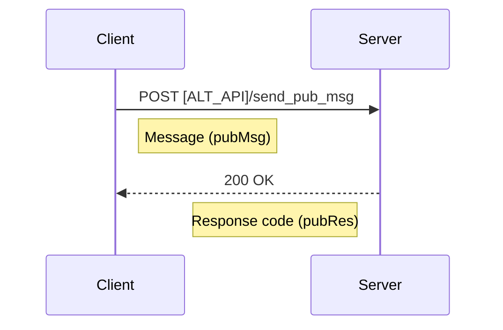
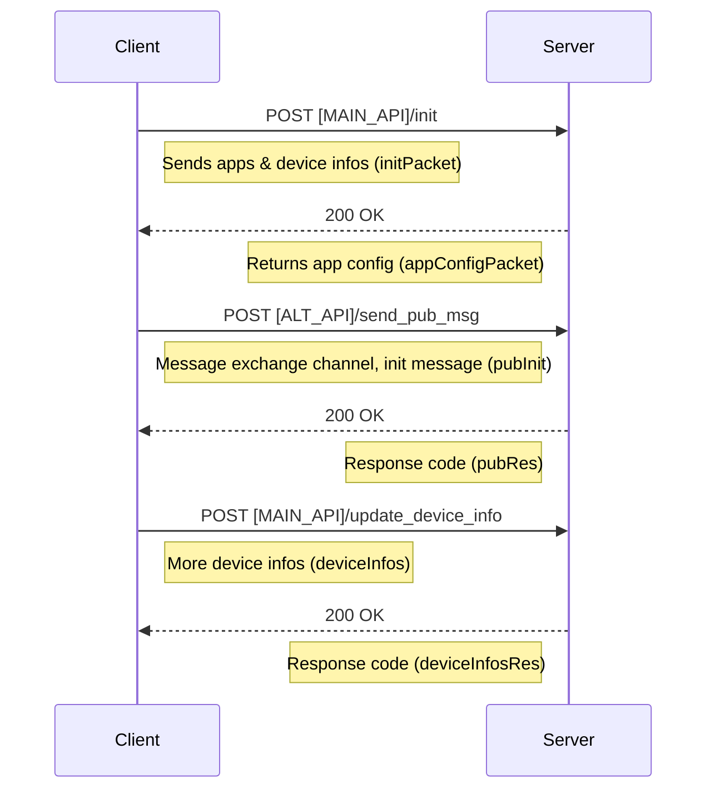
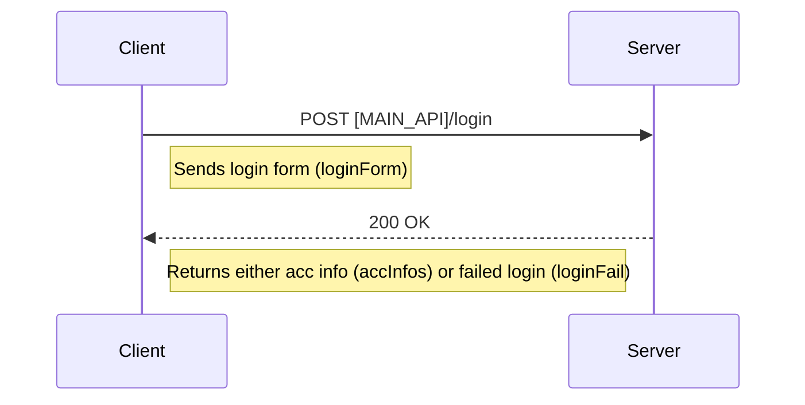
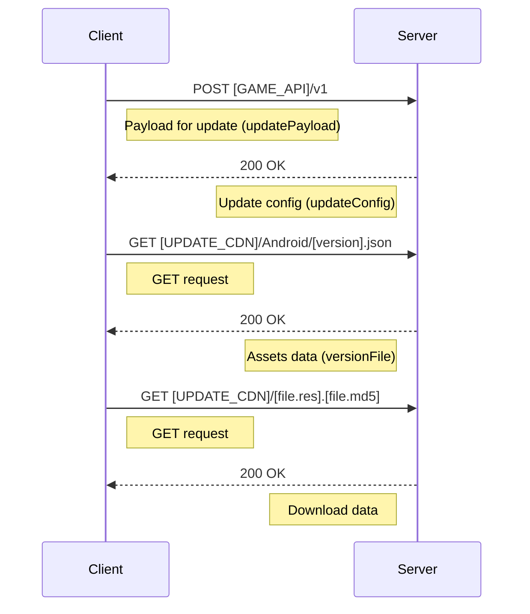
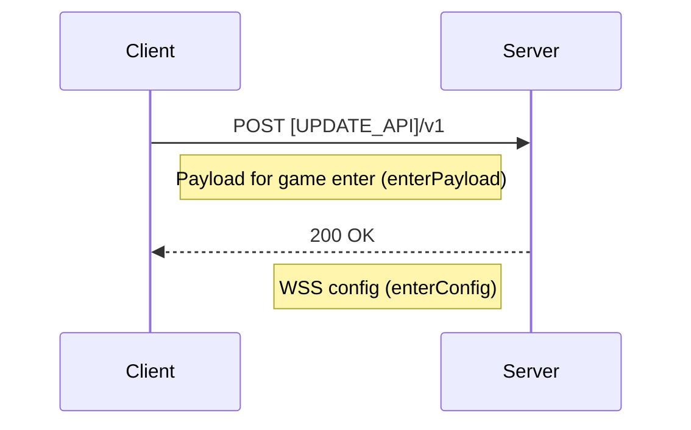

# GirlsXBattle2Decompilation
Full decompilation of the game Girls x Battle 2, as EOL is approaching, for ~~archival / private server~~ education purposes 🤓☝️

---

# Disclaimer

*This content is provided for educational and research purposes only. The author does not condone or encourage unauthorized access, distribution, or use of proprietary or confidential material. All responsibility for how this information is used lies solely with the user.*

---

# General infos

Girls x Battle 2 announced closing on June 30th, 2025. As much as I would like to work on a private server for it, I do not have the time for it, so instead I decompiled the full game and documented it a bit to provide the data here freely for anyone with enough courage to work on it to make a private server out of it. The game was decompiled from the android version at **APK base version** `1.5.686`, and **in-game version** `1.5.728`. In this repo you will find a unity project of the game, the decompiled native code library of the game (may be from the lua code itself), and infos in this readme aswell. The game is made in **Unity 2018.4.32f1** if you intend to open the project folder. The manifest for iOS assets is also present in case you want to take a look, they are slighlt different, probably adjustments for the platform.

---

# Elements in the repo & infos

## Unity project

You can find the project in the [unity](https://github.com/Escartem/GirlsXBattle2Decompilation/tree/master/unity) folder, note that the project is not ready to run, you will need to make some modifications and properly integrate the lua code in order to launch it correctly, but the repo does contains everything required for the full game. Some notable places bellow :
- [C# Scripts](https://github.com/Escartem/GirlsXBattle2Decompilation/blob/master/unity/Assets/Scripts/Assembly-CSharp), likely unity standard code and not necessarily related to the game
- [hotres](https://github.com/Escartem/GirlsXBattle2Decompilation/tree/master/unity/Assets/hotres), everything in the base folder is for the boot menu of the game, everything beyond (downloaded assets) are in this folder
- [hero web](https://github.com/Escartem/GirlsXBattle2Decompilation/tree/master/unity/Assets/hotres/spine/hero_web), biggest folder of the project, probably 80% of it, contains the characters and their textures, animations, etc


## Lua code

This is the entire source code of the game, located in the [lua](https://github.com/Escartem/GirlsXBattle2Decompilation/tree/master/lua) folder, while containing the code it does contains a few worth nothing elements that are mentionned later on this section. Also there a bat file in it at [/lua/app/common/tables](https://github.com/Escartem/GxB2Decomp/tree/master/lua/app/common/tables/del.bat) for some reason.


## libxinyoudi

This is the decompilation of the .so library found in the apk file, because the unity assets within the apk does not contain any major code, so it can be assumed it is located here. The decompilation was made pretty quickly mostly because i'm confident the lua code is the origin of the file so it can likely be ignored. Especially since the game codename is xinyoudi, GxB being the commercial name. Inside the folder you will have :
- [the decompiled C code](https://github.com/Escartem/GirlsXBattle2Decompilation/blob/master/libxinyoudi/libxinyoudi.so.c) and it's [matching header](https://github.com/Escartem/GirlsXBattle2Decompilation/blob/master/libxinyoudi/libxinyoudi.so.h)
- [the extracted strings](https://github.com/Escartem/GirlsXBattle2Decompilation/tree/master/libxinyoudi/strings) as they represent most of the file, you have both the raws strings and an attempt at sorting and cleaning them into json
- [all the functions within the lib](https://github.com/Escartem/GirlsXBattle2Decompilation/tree/master/libxinyoudi/functions)


## Data folder

Like all games, this games have configs and translations, all of them are by default stored in lua tables in [/lua/data/tables](https://github.com/Escartem/GirlsXBattle2Decompilation/tree/master/lua/data/tables) (and translation in their respective subfolder), I took the time to compile the data into SQLite databases for easier viewing and handling, inside the [data folder](https://github.com/Escartem/GirlsXBattle2Decompilation/tree/master/data) you have data.db with all the game configs and one db file for each translation config. To match them, take any table in a translation database, you will have (most of the time) a pair (id, value), the value is the translation and the id corresponds to the matching element of the same id in the same table name in data.db. See example bellow :


## Game protos

The game have a total of 6250 protos made using protobuf, you can find their definitions in [/lua/data/protos/messages_pb.lua](https://github.com/Escartem/GirlsXBattle2Decompilation/blob/master/lua/data/protos/messages_pb.lua), the naming would suggest it is related to the public messages broadcast channel explained later here but I doubt it as this is for within the game therefore using WSS and not HTTPS. I may just like the data tables do a clean version of the protos in appropriate files but for now you will have to deal with those as-is.


---

# Communications with server

Overall HTTP(S) communications between client and server, for base on login and init part, payloads taken from an android device, some fields may be hidden and replaced with [text as such], in-game part seem to be handled over WSS

### URLS
- **MAIN_API** : `mhome.carolgames.com/apis/sdk`
- **ALT_API** : `mhomeorig.carolgames.com/apis/sdk`
- **GAME_API** : `xuemeih5back.carolgames.com/api` (USES HTTP !!)
- **UPDATE_CDN** : `yottacdn.akamaized.net/xuemeiunityres`

---

### Pub messages

The game communicates with server using pubMsg, the request is json and contains the message in base64 encoded json, bellow is the structure of a pubMsg request, for the message themselves, see the specific packets defined under

#### Overview



#### Payloads

* pubMsg
```json
{
  "msg": "{\"messages\":[{\"data\":\"[BASE64 ENCODED JSON MESSAGE]\",\"attributes\":{\"eventid\":\"64d3d661-1746964618-1746964618-2-2\"}}]}",
  "attribute_lang": "fr_FR",
  "rtime": "1746964619413454",
  "error_info": "",
  "device_id": "64d3d66152258464",
  "type": "1",
  "os_type": "android",
  "sdk_version": "2.240304.1",
  "package_name": "com.carolgames.moemoegirls",
  "rkey": "[RKEY]",
  "topic": "",
  "lang": "en_US",
  "game_id": "115",
  "sign": "[SIGN]"
}
```

* pubRes
```json
{
  "error_code": "0",
  "error_msg": "(TID:81549010-b033-498d-99cf-3529abff7ea7)"
}
```

---

### Init

For when the game starts up, may be missing some steps

#### Overview



#### Payloads

* initPacket
```json
{
  "system_time": "1746964618883",
  "attribute_lang": "fr_FR",
  "rtime": "1746964618962792",
  "app_version": "1.5.686",
  "device_id": "64d3d66152258464",
  "system_lang": "fr_FR",
  "sdk_flag": "IFTFT",
  "os_version": "11",
  "channel": "",
  "advertising_id": "afdc986f-9fe8-4fd2-b2ef-a3c4523bf6fa",
  "device_type": "samsung:SM-A505FN",
  "new_privacy_version": "0",
  "device_resolution": "810*1598",
  "os_type": "android",
  "cpu_type": "ARM",
  "package_name": "com.carolgames.moemoegirls",
  "sdk_version": "2.240304.1",
  "rkey": "[UNKNOWN]",
  "appsflyer_id": "1746964618238-1700667239338582461",
  "lang": "en_US",
  "sub_device_id": "[DEVICE ID]",
  "game_id": "115",
  "sign": "[SIGN KEY]"
}
```

* appConfigPacket
```json
{
  "error_code": 0,
  "package_info": {
    "fbAppId": "204551043692742",
    "third_product_id": "com.carolgames.moemoegirls.30day",
    "payment_id": 1,
    "currency_name": "USD",
    "base64EncodedPublicKey": "[YOUR PUBLIC KEY]",
    "AppsFlyer_Key": "zoVuo66f4of7gdo2JFuATc",
    "firebase_app_id": "1:207969861579:android:03d5dc893ff679c9",
    "firebase_api_secret": "[API SECRET]",
    "line_channel_id": "1598798049",
    "is_new_pay": true,
    "use_fb_web": 0,
    "micro_end_url": "https://yottacdn.akamaized.net/xuemeih5res/1619708801_wei.html?game_back_url=xuemeih5back.carolgames.com&parent_url=1",
    "need_privacy": true,
    "privacy_version": 1,
    "channel": "gxb2en",
    "game_domain": "girlsh5.carolgames.com",
    "patch_infos": [],
    "pubsub_info": {
      "project_id": "heidao-market",
      "topic": "girlsh5_ods.sdk_events",
      "error_topic": "girlsh5_ods.dmp_log_error",
      "access_token": "[TOKEN]",
      "curr_time": 1746964619320
    },
    "auto_check": [],
    "sub_version_id": "1612517005",
    "enable_init_recaptcha": false
  },
  "channel_sdk": [],
  "device_id": "64d3d66152258464",
  "attribute_lang": "fr",
  "is_new_install": true,
  "is_return_install": false,
  "experiment_info": [],
  "device_create_time": 1746964619,
  "is_usa_strict_location": false,
  "is_applied_area": true,
  "new_privacy_tips": {
    "privacy_title": "Politique de Confidentialité et Cookies",
    "privacy_cookie_policy_content": "En installant et en jouant à ce jeu, vous acceptez nos Conditions d'Utilisation et Politique de Confidentialité. Appuyer sur \"Continuer\" ci-dessous signifie que vous acceptez tous les cookies de notre part et de nos prestataires tiers. Accepter tous les cookies offre la meilleure expérience de jeu en personnalisant votre expérience et en optimisant les performances du jeu. Pour en savoir plus, lisez notre Politique de Cookies. Pour ajuster vos paramètres de cookies, comme l'ajustement de votre expérience publicitaire, veuillez appuyer sur ici.",
    "second_privacy_cookie_policy_content": "Modifier ces paramètres de cookies peut altérer votre expérience de jeu. Pour en savoir plus, veuillez lire notre Politique de Cookies. Si vous souhaitez personnaliser vos préférences en matière de cookies, vous pouvez basculer les interrupteurs ci-dessous et appuyer sur Confirmer Mes Choix.",
    "accept_all": "Confirmer Mes Choix",
    "accept_control": "Tout Autoriser",
    "continue": "Continuer",
    "privacy_cookie_policy_content_bold_front": [
      "Appuyer sur \"Continuer\" ci-dessous signifie que vous acceptez tous les cookies de notre part et de nos prestataires tiers.",
      "Accepter tous les cookies"
    ],
    "match_replace": {
      "terms_of_service": {
        "match_txt": "Conditions d'Utilisation",
        "replace_value": "https://mhome.carolgames.com/fr/article/terms_of_use?game_id=115&device_id=64d3d66152258464",
        "underlined": true
      },
      "privacy_policy": {
        "match_txt": "Politique de Confidentialité",
        "replace_value": "https://mhome.carolgames.com/fr/article/privacy_policy?game_id=115&device_id=64d3d66152258464",
        "underlined": true
      },
      "cookie_policy": {
        "match_txt": "Politique de Cookies",
        "replace_value": "https://mhome.carolgames.com/fr/article/cookie_policy?game_id=115&device_id=64d3d66152258464",
        "underlined": true
      }
    },
    "mark_value": {
      "here": {
        "match_txt": "ici",
        "event": "in_page_jump",
        "underlined": true
      }
    },
    "strictly_cookie_button": {
      "button_name": "Cookies strictement nécessaires",
      "button_value": "Ces cookies essentiels sont nécessaires au fonctionnement de l'application et ne peuvent pas être désactivés. Ils s'activent pour des actions telles que la configuration des préférences de confidentialité, la connexion ou le remplissage de formulaires. Notez que ces cookies ne stockent aucune information personnelle.",
      "button_status": true,
      "button_status_txt": "Toujours activé"
    },
    "performance_cookie_button": {
      "button_name": "Cookies de Performance",
      "button_value": "Ces cookies suivent les visites et le trafic pour améliorer les performances de l'application. Ils nous montrent les fonctionnalités populaires et moins utilisées, nous aidant à comprendre la navigation des joueurs. Sans ces cookies, nous ne pouvons pas surveiller efficacement les performances de l'application.",
      "button_status": false
    },
    "marketing_cookie_button": {
      "button_name": "Publicité Personnalisée",
      "button_value": "Nous collaborons avec des annonceurs tiers dans notre application pour fournir des publicités personnalisées. Ces partenaires peuvent recueillir des données sur vos interactions à des fins de publicité ciblée. Vous pouvez désactiver cette fonctionnalité dans les paramètres de l'application. Désactiver cette fonctionnalité signifie que vous verrez toujours des publicités, mais elles ne seront pas personnalisées en fonction de votre activité dans l'application.",
      "button_status": false
    },
    "need_show": true,
    "new_privacy_version": 1
  },
  "single_layer_privacy_info": [],
  "recorded_cpu_type": 1,
  "events_not_track": {
    "appsflyer": [
      "af_skad_revenue",
      "vip3",
      "vip1",
      "5star-1",
      "5star-2",
      "5star-3",
      "5star-4",
      "5star-5",
      "5star-6",
      "5star-7",
      "5star-8",
      "5star-9",
      "5star-10",
      "stage_1_9",
      "stage_3_6",
      "stage_5_2",
      "stage_7_2",
      "stage_10_3",
      "stage_13_7",
      "stage_17_7",
      "lv10",
      "lv20",
      "lv32",
      "lv40",
      "lv50",
      "lv60",
      "lv70",
      "lv80",
      "lv90",
      "lv100",
      "af_purchase",
      "af_purchase_small",
      "af_purchase_plus"
    ],
    "firebase": [],
    "facebook": [],
    "adjust": []
  },
  "origkey": "[SIGN KEY]",
  "ip": "[YOUR IP]"
}
```

* pubInit (Note: this is the json content of the message itself, the entire request is different)
```json
{
    "event_type": 8,
    "system_info": "get game package success",
    "stage_id": 10002,
    "app_v": "1.5.686",
    "timestamp_mills": 1746964619412,
    "device_id": "64d3d66152258464",
    "platform_id": "29",
    "os_type": "android",
    "req_id": "2-2",
    "sdk_version": "2.240304.1"
}
```

* deviceInfos
```json
{
  "attribute_lang": "fr",
  "rtime": "1746964619450907",
  "device_id": "64d3d66152258464",
  "os_type": "android",
  "sdk_version": "2.240304.1",
  "package_name": "com.carolgames.moemoegirls",
  "rkey": "[RKEY]",
  "google_install_info": "{\"referrer_url\":\"utm_source=google-play&utm_medium=organic\",\"referrer_click_time\":0,\"click_download_time\":1746964168,\"local_referrer_click_time\":0,\"local_click_download_time\":1746964170,\"app_install_time\":1746964603190}",
  "lang": "en_US",
  "game_id": "115",
  "sign": "[SIGN]"
}
```

* deviceInfosRes
```json
{
  "error_code": 0,
  "error_msg": "",
  "data": {
    "conversion_value": -1
  }
}
```

---

### Login

Login works either with legacy (username & password) or SDK (game center, google, FB, etc), only covering legacy here as sdk uses another api channel but response is the same anyway

#### Overview



#### Payloads

* loginForm (password is sent as clear text)
```json
{
  "password": "[PASSWORD]",
  "attribute_lang": "fr",
  "player_id": "1018341991",
  "rtime": "1746965496537336",
  "device_id": "64d3d66152258464",
  "login_email": "[LOGIN]",
  "os_type": "android",
  "sdk_version": "2.240304.1",
  "package_name": "com.carolgames.moemoegirls",
  "rkey": "[REKY]",
  "lang": "fr_FR",
  "game_id": "115",
  "sign": "[SIGN]"
}
```

* accInfos
```json
{
  "error_code": 0,
  "is_reg": 0,
  "device_id": "64d3d66152258464",
  "uid": "3354405055",
  "nickname": "Escartem",
  "login_email": "Escartem",
  "user_create_time": "1636213449",
  "tp_code": "email",
  "is_anonymous": 0,
  "login_token": "[TOKEN]",
  "session_id": "[SESID]"
}
```

* loginFail
```json
{
  "error_code": 403,
  "error_msg": "This account does not exist"
}
```

---

### Updates

For when the games updates itself

#### Overview



#### Payloads

* updatePayload
```json
{
    "payload":
    {
        "os": "android",
        "is_unity": 1,
        "mid": 1044,
        "app_v": 1,
        "device_id": "64d3d66152258464",
        "lang": "en_en"
    }
}
```

* updateConfig
```json
{
  "mid": 1044,
  "payload": {
    "host": "xuemeih5back.carolgames.com",
    "is_review": 0,
    "min_version": "1.5.248",
    "version": "1619629629",
    "port_s": 443,
    "port": 80,
    "unity_android_version": "{\"curr_version\":\"1.5.728\",\"min_version\":\"1.5.248\",\"min_hot_version\":\"1.5.728\"}",
    "is_maintenance": 0,
    "curr_version": "1.5.728",
    "unity_ios_version": "{\"curr_version\":\"71.3.808\",\"min_version\":\"71.3.310\",\"min_hot_version\":\"71.3.808\"}",
    "min_hot_version": "1.5.728"
  }
}
```

* versionFile (version file is a list of files, only giving example for one here)
```json
{
    "version": "1.5.728",
    "resources": [
        {
            "path": "Android",
            "res": "Android/Android",
            "type": 1,
            "md5": "5d21e15383855bc2404fa7bac8612e12",
            "size": 364664
        }
    ]
}
```

* Note when downloading, for URL make sure to use the `res` field and adding the md5 at the end, but when saving the data it must but stored in the `path` field within the game files instead

---

### Enter game

After all is done, enter game, switching to WSS, at this point you must look at the lua code directly to figure out the protos

#### Overview



#### Payloads

* enterPayload
```json
{
    "payload":
    {
        "is_anonymous": 0,
        "mid": 1,
        "server_id": 0,
        "os_id": 1,
        "platform_id": 29,
        "sid": "[SESSION ID]",
        "login_token": "[LOGIN TOKEN]",
        "app_v": "1.5.686",
        "res_v": "1.5.686",
        "time_zone": 1,
        "lang": "fr_fr"
    }
}
```

* enterConfig
```json
{
  "mid": 1,
  "payload": {
    "use_pvr": 1,
    "is_new": false,
    "gm_url": "nil",
    "gate_host": "xuemeih5gate.carolgames.com",
    "log_url": "http://xuemeih5back.carolgames.com:80/log",
    "gate_port": 20210,
    "player_id": "[PLAYER ID]",
    "uid": "3354405055",
    "wb_port": 20212,
    "last_time": 1746965679,
    "token": "[ENTER TOKEN]",
    "wbs_port": 20213,
    "server_time": 1746965679
  }
}
```

---

# Credits

If you use in any way this project, any credit would be appreciated, feel free to also directly contribute here ! I don't have the time and energy to do a full server implementation (especially with 6k protos) but if any of you is, this is your base. And props to the dev of the game as well for making it~ I had fun playing GxB 1 and 2 over the last 7 years, farewell (* ￣︿￣)
